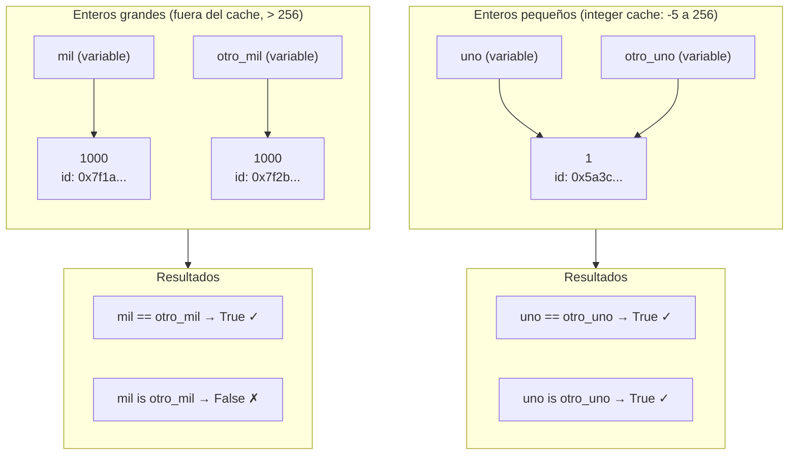

# Clase tres - 11/03/2026 

# Repaso

* Git
  * Creamos repo
  * Comandos basicos
    * Bajar un repo : git clone <URL repo>
    * Marcar archivos para agregar a stagging (local): git add *
    * Mostrar cambios pendientes de confirmar : git status
    * Como subo o confirmo los cambios a stagging (local) : git commit -m "Mensaje explicativo"
    * Subir cosas a repositorio remoto (internet) : stagging -> remoto: git push / git push origin main (o rama)
    * Como bajo las cosas que otros subieron al repositorio remoto : git pull
      
* Python
  * Librerias
    * Pygame: Armamos un juego con la ayuda de la IA
    * Django: Para hacer apps web
    * Aprendimos a instalar librerias localmente con pip istall <nombre de la libreria>
  * Tipos de datos basicos en Python
    
* Visual Studio Code
  * Extensiones
    * Live Share (Para trabajar el mismo codigo remoto con otra persona en simultaneo)

# Python

* Colab de la clase
> https://colab.research.google.com/drive/1_ecrF_2YjlNHYSldkTU3OJAFp_mrgqGR?usp=sharing
* Preguntas a chatgpt
> https://chatgpt.com/share/69b3462e-5660-8007-9cc7-7b38799c0f12

# Condicionales

* Vimos el IF

```python
# Importo objeto random que ya existe en python y lo programó otro
import random 
# Le pido al objeto random que me de un numero entre 1 y 10
random_number = random.randint(1,10)

if random_number < 5:
  variable = 10
else:
  variable = "Hola"

if isinstance(variable, int):
  print("La variable es un entero")
elif isinstance(variable, str):
  print("La variable es un string")
```



## Tipos de Datos y Objetos

* Built-in functions (Funciones que vienen con el lenguaje)
  * type
  * dir
  * print
  * input
  * isinstance
  * id

* Funciones de objetos
  * Los objetos / variables de tipo str
    * upper
    * replace
  * Los objetos / variables de tipo int
    * bit_length
   
## Operadores


* == : Compara el contennido de dos variables
* is : Dice si las dos variables son el mismo objeto
   
## Identidades de objetos en python

```python
uno = 1
otro_uno = 1
print(id(uno))
print(id(otro_uno))

if uno == otro_uno:
  print("Las dos variables almacenan el mismo valor")

if uno is otro_uno:
  print("Las dos variables son el mismo objeto, son lo mismo")

mil = 1000
otro_mil = 1000
print(id(mil))
print(id(otro_mil))

if mil == otro_mil:
  print("Las dos variables almacenan el mismo valor")

if not (mil is otro_mil):
  print("Las dos variables no son el mismo objeto")
```
   


## Entornos Virtuales

* Cuando instalas un programa con pip install lo instala global para todos mis programas en python
  * Se puede ver con:
    * pip --version
    * pip show <nombre libreria>
* Ahora que pasa cuando tengo dos programas que usan la misma libreria pero necesitan versiones distintas?
  * Hay que usar entornos virtuales
    * Entornos aislados que tienen una copia de la libreria que usa mi programa
* El lio de las librerias no es solo en python, cada lenguaje tiene su administrador de paquetes


  

## Tipos de Aplicaciones

## Para hacer 

* Hacer desafios y laboratorios del modulo 1
